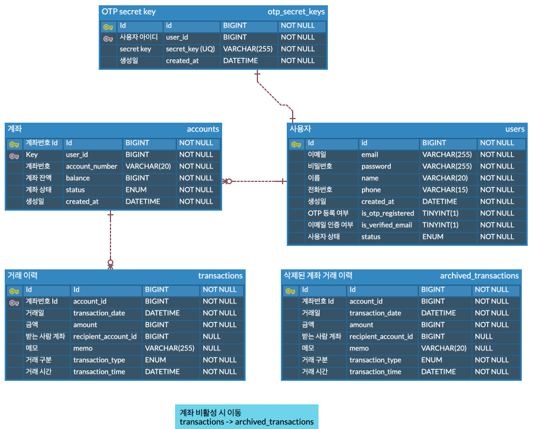

# 💳 핀테크 프로젝트
계좌 생성을 비롯한 계좌 관리 부터 입금, 출금, 송금 등이 가능한 금융 거래 서비스 입니다.

## 📃  프로젝트 기능 및 설계

### ✔️ 인증

#### 회원가입 및 탈퇴 기능

- 사용자는 email, password, 휴대폰번호, 이름을 통해 회원가입을 진행한다.
- 사용자는 회원가입 요청을 통해 회원가입 인증 메일을 받을 수 있다.
  해당 인증 메일에 포함된 QR 코드를 통해 OTP secret key 등록 까지 같이 할 수 있다.
- 사용자는 회원 탈퇴를 해도 금융법에 따라 일정 기간 동안 해당 사용자의 정보와 거래 내역이 보관 된다.  
  (민감 정보는 해싱 처리 되어 저장된다.)

#### 로그인 기능

- 회원 가입 시 입력 했던 이메일과 비밀번호를 통해 로그인 요청을 보내고
  → 회원 가입 인증 여부, OTP 인증 등록 여부를 확인 한 뒤  
  → JWT Token이 정상적으로 발행 되면 로그인에 성공

- 사용자는 무조건 로그인이 완료 된 후  모든 서비스에 접근이 가능하다.

### ✔️ 계좌관리

#### 계좌 생성및 삭제

- 사용자는 계좌 생성, 삭제 시점에 추가 OTP 인증을 별도로 거쳐야 한다.
- 계좌 삭제 시 일정 기간 동안 해당 계좌의 거래 내역과 계좌정보를 저장한다.(기본적인 금융 원칙)
- 계좌 삭제 요청 시, 데이터베이스에서 완전히 삭제 하는게 아닌 비활성화(Soft Delete)처리를 한다.

#### 계좌 검색 기능

- 사용자는 본인이 보유한 계좌를 검색할 수 있다. 총 3개의 계좌까지 개설, 관리가 가능하다.
- 사용자가 이전에 삭제한 계좌는 검색할 수 없다.

### ✔️ 입금 / 출금
**거래 구분 - DEPOSIT / WITHDRAW**

- 사용자는 금액 출금, 입금을 요청하는 시점에 추가 OTP 인증을 별도로 거쳐야 한다.

### ✔️ 송금
**거래구분 - TRANSFER**

#### 송금 이력 데이터를 활용한 스마트 송금 기능

- 송금도 마찬가지로 OTP 인증을 마친 후 할 수 있다.
- 스마트 송금기능을 사용할 수 있다.
  (최근 송금 이력 및 송금 횟수를 기반으로 limit을 정해 송금 내역을 정렬하여 가져올 수 있다.)
- 송금 이력을 조회 할 시, 해당 리스트에 대한 정렬은
- 1순위: 마지막 송금 계좌를 우선 추천
- 2순위: 일정 기간 내 가장 많이 거래된 계좌 순으로 추천

#### 송금 이력 조회 기능

- 송금 이력은 최신순으로 정렬하며, 사용자가 자주 송금하는 계좌는 즐겨찾기 기능을 통해 리스트 상단에 고정할 수 있다.
- 계좌 삭제 요청 시 비활성화 하는 시점에서,삭제된 계좌의 송금 이력은  archive_transactions 테이블로 이동시켜 관리한다.

## 📃 ERD

## 📃 Tech Stack

- Spring Boot 3.4.2
- Java 17
- MySQL 8.0
- JPA
- Spring Security 6
- Google Authenticator

## 📃 Trouble Shooting
[go to the trouble shooting section](doc/TROUBLE_SHOOTING.md)